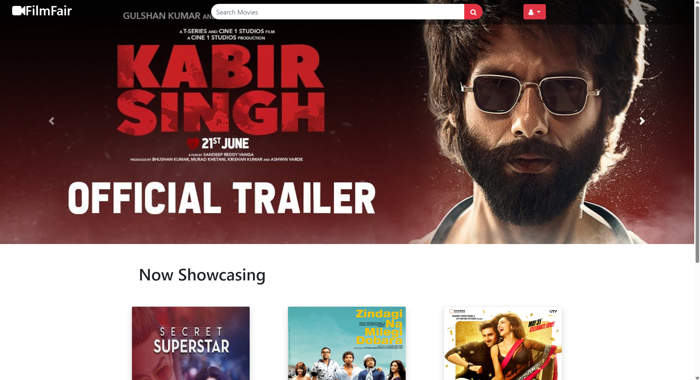
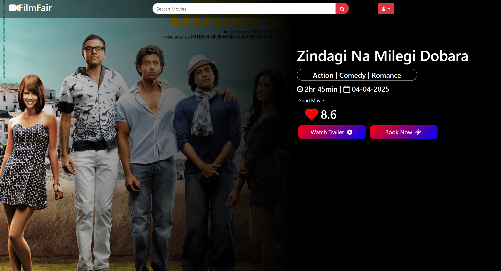
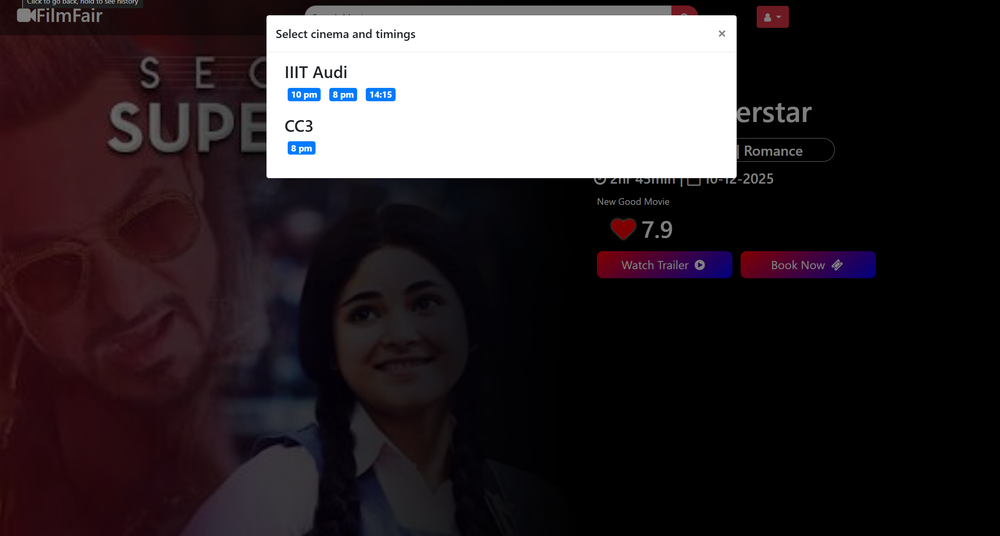
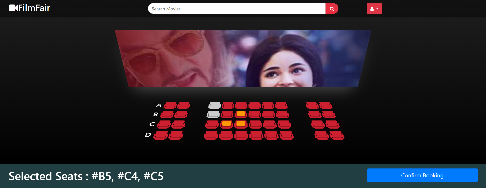
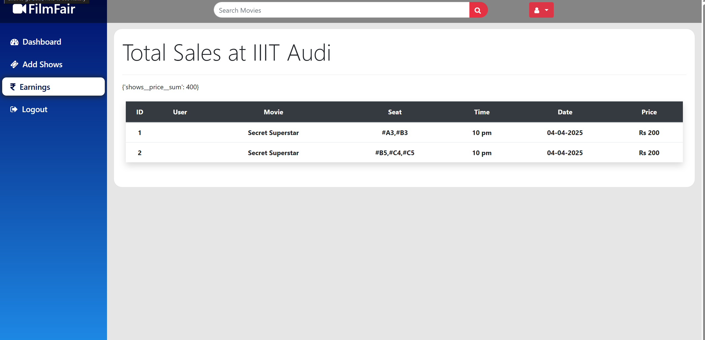
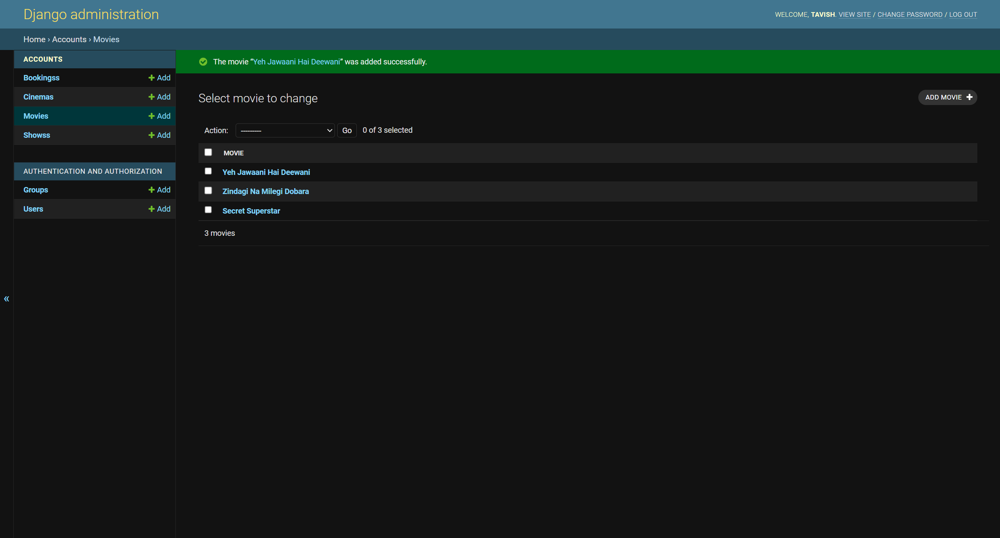

# 🎟️ FilmFair (Django Movie Ticket Booking System)

**FilmFair** is a modern web-based application for managing movie ticket bookings. Built with Django and MySQL, it allows administrators to efficiently manage movies, show timings, bookings, and customer data through an intuitive interface.

---

## 📸 Screenshots








---

## 🚀 Getting Started

Follow these steps to get **FilmFair** up and running on your local machine for development and testing.

### 📦 Prerequisites

- Python 3
- MySQL Server

---

## ⚙️ Installation

1. Clone the repository:
   ```bash
   git clone https://github.com/your-username/FilmFair.git
   cd FilmFair
   ```

2. Install dependencies:
   ```bash
   pip install -r requirements.txt
   ```

3. Create a `.env` file in the root directory with the following content:
   ```env
   SECRET_KEY=your_secret_key
   DB_NAME=your_database_name
   DB_USER=your_mysql_user
   DB_PASSWORD=your_mysql_password
   DB_HOST=localhost
   DB_PORT=3306
   ```

4. Apply migrations and create a superuser:
   ```bash
   python manage.py migrate
   python manage.py createsuperuser
   ```

5. Start the development server:
   ```bash
   python manage.py runserver
   ```

Access the application at [http://127.0.0.1:8000](http://127.0.0.1:8000)

---

## 🛠️ Built With

- [Django](https://www.djangoproject.com/) - Backend Framework
- [MySQL](https://www.mysql.com/) - Relational Database
- [Bootstrap](https://getbootstrap.com/) - Frontend UI Toolkit

---

## 📬 Contact

For feedback or contributions, feel free to open an issue or pull request.

---


---

## 👤 Author

**Tavish Chawla**  
📧 [tchawla827@gmail.com](mailto:tchawla827@gmail.com)  
🎓 B.Tech, IIIT Allahabad

---
